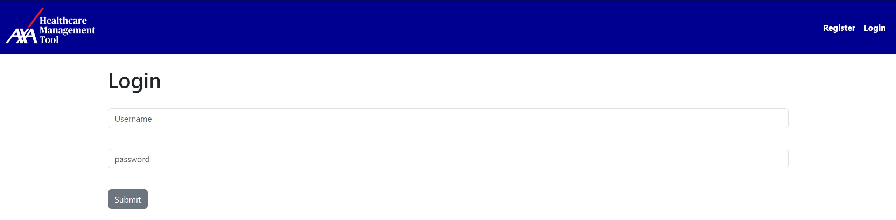
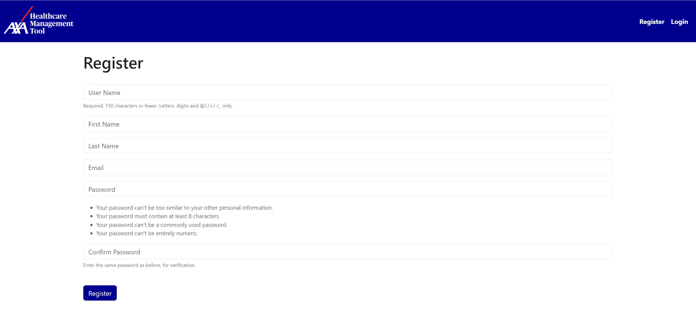
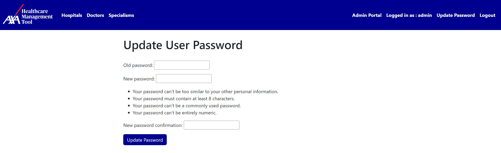
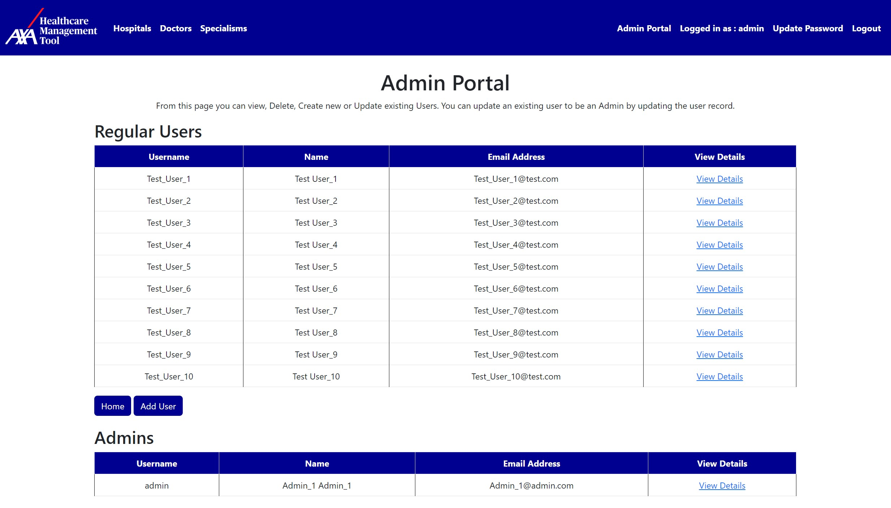
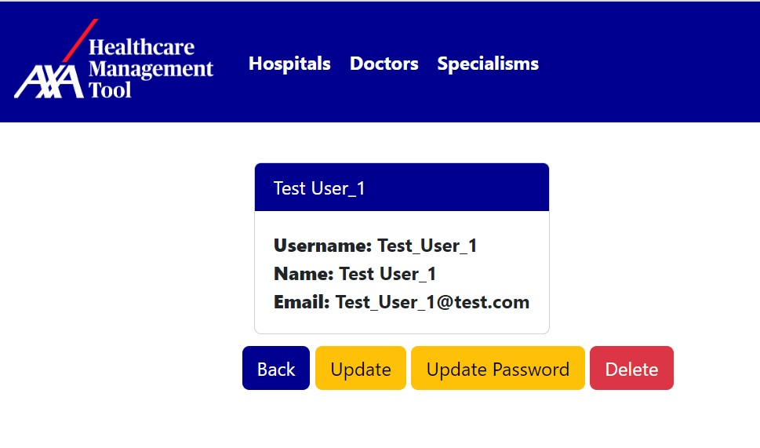
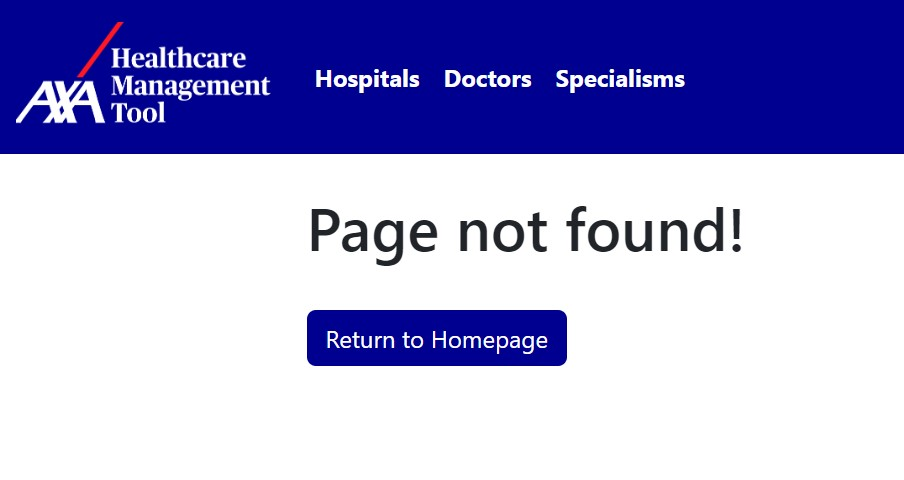
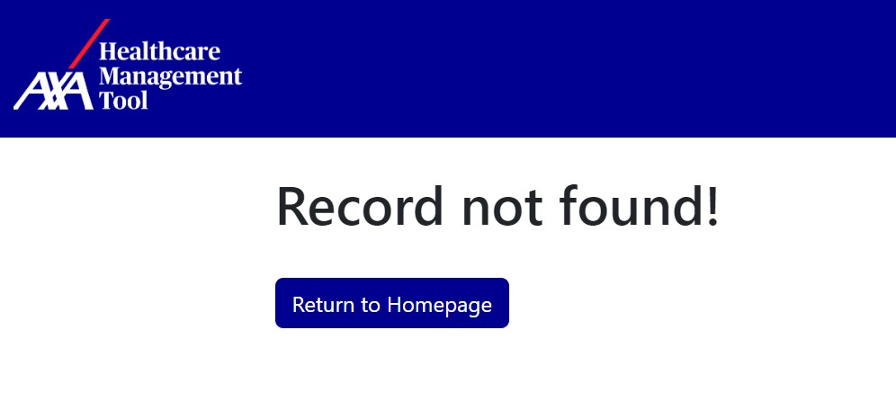

# AXA Healthcare Management Tool

The AXA Healthcare Management Tool is a CRM Tool used to Manage Hospitals, Doctors and Doctor Specialisms. 


Users can use this application to Manage Doctors used within Health Insurance, the Doctors who work there and the Specialisms that those Doctors have. 

# Table of Contents

- [AXA Healthcare Management Tool](#axa-healthcare-management-tool)
- [Installation](#installation)
- [Database Design](#database-design)
- [Usage](#usage)
- [Administration](#Administration)

## Installation

This application requires Python, Django, MySql and various other modules. The GitHub codebase can be found [here (Github.com/crawftie/Django-CRM)](https://github.com/crawftie/Django-CRM).

Links to the key documentation for dependancies can be found here -

[Python](https://docs.python.org/3/)

[Django](https://docs.djangoproject.com/en/4.2/)

[MySql](https://dev.mysql.com/doc/)

MySql needs to be installed and a local database created, the 'root' user credentials will need to then be provided later on in the setup, so store these securely once created.

To Create a Python Project to run this application, you must first create a local enviroment and create a local database. Instructions on how to do this can be found in the documentation above, but in summary a user must run these commands:

Navigate the the Local Repo 

```bash
python -m venv virt
source virt/scripts/activate
```

All dependencies can then be installed with this command:

```bash
pip install -r requirements.txt
```

The Database can then be created, and a superuser needs to be created:

```bash
python mydb.py
python manage.py migrate
python manage.py createsuperuser
```

The Super User created at this stage will be the user which you are able to log in to the application to access the admin portal or delete records from within the application.

To use this database, update the datbase variables to match this, replacing 'YOUR_PASSWORD' with the password to the Root MySQL user you created during the creation of the MySQL database.
```python
DATABASES = {
    'default': {
        'ENGINE': 'django.db.backends.mysql',
        'NAME': 'SDA',
        'USER': 'root',
        'PASSWORD': 'YOUR_PASSWORD',
        'HOST': 'localhost',
        'PORT': '3306',
    }
}
```

Once all of these installations are completed, run the following command to start the local Django Server:

```bash
python manage.py runserver 
```

## Database Design

The Database contains Four Tables
- Users
    - This table contains users of the application, including admin and non-admin users
- Hospitals
    - This table contains Hospital Data
- Doctors
    - This table contains Doctors Data
- Doctors Specialism
    - This table contains Doctors Specialism Data

The Users Table is not related to any of the other tables and only contains user data and credentials that users use to login to the application.

The Hospitals, Doctors and Doctors Specialism Tables are related. A Hospital can contain employ multiple doctors and each of these doctors has a specialism. This is reflected in the table structure as shown in this Entity Relationship Diagram:


<p style="text-align: center;">Entity Relationship Diagram</p>

As shown in the Entity Relationship Diagram, Hospitals have a Many to Many Relationship with Doctors, as a Hospital can employ many Doctors, but a Doctor is also able to be employed across multiple hospitals. Doctors have a one to one relationship with Specialisms, as a Doctor can only have a single Specialism.

## Usage

### Login

The Application Runs within a Web browser and defaults to the domain 'http://localhost:8000/'. 

During the creation of the dependancies, a Super User would have been created which is the credentials that will be used to first log in to the application, this is the Admin Account.

If a user is not logged in and navigates to the homepage, they will be prompted to Login.


<p style="text-align: center;">Login Page</p>

If a user enters invalid credentials, they recieve an error and are prompted to attempt to login again.


<p style="text-align: center;">Login Page Error</p>

If a user does not have an existing account, they can register using the button in the top right hand side of the navbar. This will create a non-admin user which is able to Create, Read and Update Records. Only an Admin / Super User is able to Delete records from tables, superusers can only be created in the backend of the django application.


<p style="text-align: center;">Registration</p>

When a user has logged in, they are able to update their own password using the 'Update Password' button in the top righthand side of the Navbar. 


<p style="text-align: center;">Update Password</p>

### Home

Once logged in, a user is taken to the homepage. From here a user can navigate to the three core pages of the application:
- View Hospitals
- View Doctors
- View Specialisms


<p style="text-align: center;">Admin Logged in on Homepage</p>


Note in the above screenshot, that an admin user is logged in, giving them an 'Admin Portal' option in the top right of the Navbar. This button only appears for Admin Users, and if navigated to by a Non-Admin, they are presented with an Message and directed back to the homepage.


<p style="text-align: center;">Non-Admin Logged in on Homepage</p>

### View Hospitals

A user is able to view a list of all avaliable hospitals. From this page a user can see the Hospital details in a table.


<p style="text-align: center;">View Hospitals</p>

If they want to view only a specific hospital, they can select the 'View Details' button to navigate to a view of only that hospital.


<p style="text-align: center;">View Hospital Record</p>

From this record any user can update that Hospital, updating any detail, including adding or removing Doctors that work there. Deleting the Hospital is only authourised if the user currently logged in is an admin. 


<p style="text-align: center;">Update Hospital Record Form</p>

In this example, i have added Test_Doctor_2 as a Doctor that works at Test_Hosptial_1, alongside the existing Test_Doctor_1. The User can see this update reflected if they select the 'View Doctors' option in the table on the View Hospitals page.


<p style="text-align: center;">Updated Hospital Record</p>

If a non-admin attempts to delete a hospital, they are returned to the View Hospitals Page and shown a message informing them that only Admins can Delete Hospitals.


<p style="text-align: center;">Non-Admin Deletion Message</p>

Users can add new hospitals using the 'Add Hospital' button. Error handling is in place on the form to ensure that users input the correct datatypes in to the fields, for example in the screenshot below the user is prompted to provide a valid Email Address when they attempt to add a hospital with incorrect data.


<p style="text-align: center;">Email Error Message</p>

When an Admin is logged in, they are able to successfully delete Hospital Records and are presented with a message telling them the operation was completed successfully.


<p style="text-align: center;">Admin Deletion Message</p>

### View Doctors

A user is able to view a list of all avaliable Doctors. From this page a user can see the Doctor details in a table.


<p style="text-align: center;">View Doctors</p>

If they want to view only a specific Doctor, they can select the 'View Details' button to navigate to a view of only that Doctor.


<p style="text-align: center;">View Doctor Record</p>

From this record any user can update that Doctor Record. Deleting the Doctor is only authourised if the user currently logged in is an admin. The user is presented with the same messages as shown in the View Hospitals section of this ReadMe, depending on if they are an admin or non-admin.

Similarly, like how a user can add a new hospital, they can also add a new Doctor. Error handling is also present in Doctor Creation, and the user is presented with a list of Doctor Specialisms that a Doctor can have. 


<p style="text-align: center;">Add Doctor Record</p>

### View Specialisms

A user is able to view a list of all avaliable Doctors Specialisms. From this page a user can see the Doctor Specialism details in a table.


<p style="text-align: center;">View Doctor Specialisms</p>

If they want to view only a specific Doctor Specialism, they can select the 'View Details' button to navigate to a view of only that Doctor Specialism.


<p style="text-align: center;">View Doctor Specialism Record</p>

From this record any user can update that Doctor Specialism Record. Deleting the Doctor Specialism is only authourised if the user currently logged in is an admin. The user is presented with the same messages as shown in the View Hospitals section of this ReadMe, depending on if they are an admin or non-admin.

Similarly, like how a user can add a new hospital, they can also add a new Doctor Specialism. 


<p style="text-align: center;">Add Doctor Specialism Record</p>

## Administration

When logged in as an Admin, the admin is able to Create, Remove, Update and Delete Users. 


<p style="text-align: center;">Admin Portal</p>

An Admin is also able to update other users details and their passwords. When updating a non-admin user, an admin can make them a super user by selecting a tickbox. Vice-Versa, an admin can be downgraded to a normal user by unticking the box.


<p style="text-align: center;">User Record</p>


<p style="text-align: center;">Update User Record</p>

An admin can also update a users password without needing to know their previous password. 


<p style="text-align: center;">Update User Password</p>

An Admin is also able to Delete user accounts, and they are presented with a message once it has been completed.


<p style="text-align: center;">Delete User</p>

## Error Handling

If a user navigates to a page that does not exist, they will recieve a custom 404 error and be prompted to Return to the Homepage via a button. 


<p style="text-align: center;">404 Error</p>

If a user navigates to a record that does not exist, they will recieve a custom 500 error and be prompted to Return to the Homepage via a button. 


<p style="text-align: center;">500 Error</p>

